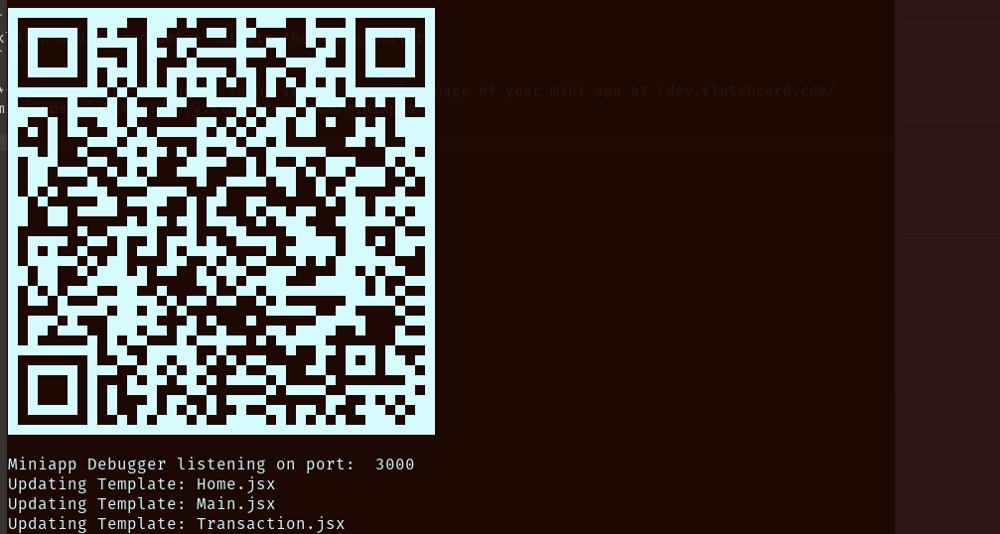

# Klutch Card CLI

Klutch CLI early access is available in early access for mini app developers. The primary feature available in this CLI is 

## Prerequisites
* Klutch developer account. Register at (dev.klutchcard.com)[https://dev.klutchcard.com/#!/docs]
* Nodejs and NPM installed
* A configured miniapp uploaded to the dev portal.
* Expo app for launching the app in debug mode.

## Installation
```
npm i -g @klutch-card/klutch-cli
```

After installing, the CLI is available using the `klutch` command.

## Usage

To launch your Klutch mini app in debug mode using the CLI run.

```
klutch debug <recipeId> Starts the Debug Server
```

*** Your recipe ID can be found in the `Details` page of your mini app at (dev.klutchcard.com/miniapps/)[]https://dev.klutchcard.com/miniapps/

After running the command, you will receive a QR code.



Scan the QR code using the expo app to launch the Klutch app in sandbox mode with your dev mini app installed.

## Commands

```
klutch init                  //Creates a blank miniapp template.
```